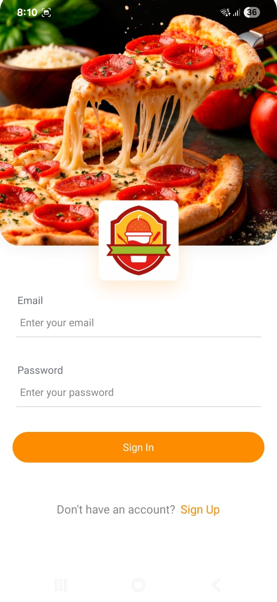
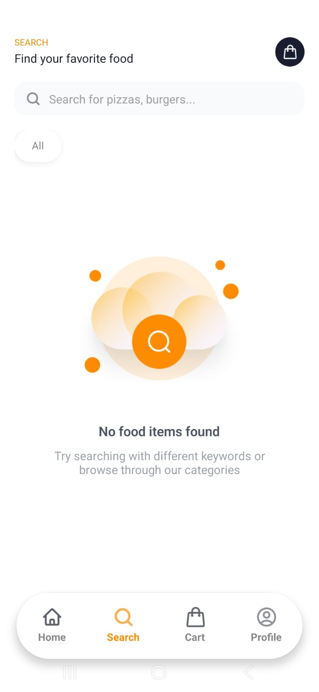
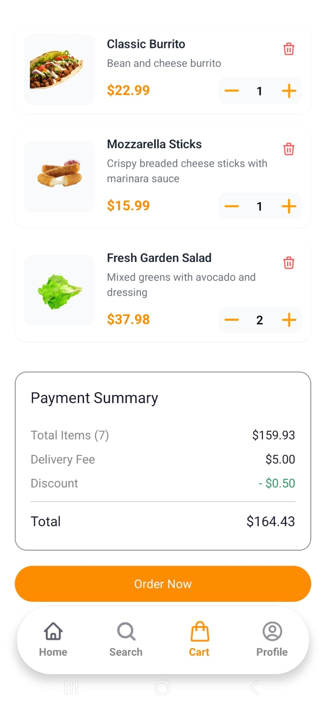
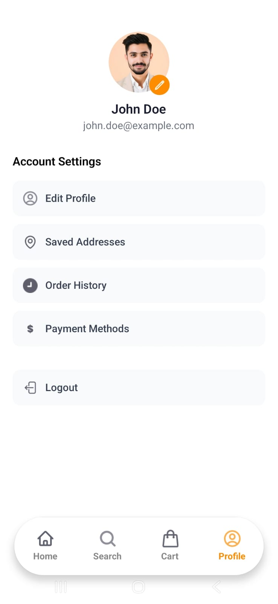

# Food Delivery App

A modern React Native food delivery application built with Expo, featuring a clean UI, seamless payment integration, and real-time order tracking.

## 🛠️ Tech Stack

- **Frontend**: React Native with Expo
- **Styling**: NativeWind (Tailwind CSS for React Native)
- **Navigation**: Expo Router with file-based routing
- **State Management**: Zustand for cart and auth state
- **Backend**: Appwrite for database and authentication
- **Payments**: Stripe React Native SDK
- **Icons & Images**: Expo Vector Icons and custom assets

## 📸 Screenshots

<div align="center">
  
  
  
  
  
</div>

## 🚀 Getting Started

### Prerequisites

- Node.js (v16 or higher)
- Expo Go app on your physical device

### Installation

1. **Clone the repository and install dependencies**

   ```bash
   npm install
   ```

2. **Set up environment variables**

   Create a `.env` file in the root directory and add your API keys:

   ```env
   EXPO_PUBLIC_APPWRITE_ENDPOINT=your_appwrite_endpoint
   EXPO_PUBLIC_APPWRITE_PROJECT_ID=your_appwrite_project_id
   EXPO_PUBLIC_STRIPE_PUBLISHABLE_KEY=your_stripe_publishable_key
   ```

3. **Start the development server**

   ```bash
   npx expo start
   ```

4. **Run on your preferred platform**

   In the output, you'll find options to open the app in:
   - [Development build](https://docs.expo.dev/develop/development-builds/introduction/)
   - [Android emulator](https://docs.expo.dev/workflow/android-studio-emulator/)
   - [iOS simulator](https://docs.expo.dev/workflow/ios-simulator/)
   - [Expo Go](https://expo.dev/go) app on your physical device

## 📁 Project Structure

```
├── app/                    # Main app screens (file-based routing)
│   ├── (auth)/            # Authentication screens
│   ├── (tabs)/            # Tab-based screens
│   ├── food-detail/       # Food detail screens
│   ├── checkout.tsx       # Checkout screen
│   └── order-confirmation.tsx
├── components/            # Reusable UI components
├── lib/                   # Utilities and services
│   ├── appwrite.ts       # Appwrite configuration
│   ├── stripe.ts         # Stripe payment service
│   └── data.ts           # Sample data
├── store/                # State management
├── assets/               # Images, icons, and fonts
└── constants/            # App constants
```

## 🔧 Configuration

### Appwrite Setup

1. Create an Appwrite project at [appwrite.io](https://appwrite.io)
2. Set up the following collections:
   - Users
   - Categories
   - Menu Items
   - Customizations
3. Update the `appwriteConfig` in `lib/appwrite.ts` with your database and collection IDs

### Stripe Setup

1. Create a Stripe account at [stripe.com](https://stripe.com)
2. Get your API keys from the [Stripe Dashboard](https://dashboard.stripe.com/apikeys)
3. Add your publishable key to the environment variables
4. Set up a backend server for handling payment intents (see `README_STRIPE_SETUP.md`)

## 📱 App Screens

- **Home**: Browse featured items and categories
- **Search**: Search and filter menu items
- **Food Detail**: View item details and add customizations
- **Cart**: Review selected items and quantities
- **Profile**: User account and settings
- **Authentication**: Sign in/up screens

## 🎨 Customization

The app uses NativeWind for styling, which allows you to use Tailwind CSS classes in React Native. You can customize the theme in `tailwind.config.js`.

## 🙏 Acknowledgments

- Built with [Expo](https://expo.dev)
- UI inspired by modern food delivery apps
- Icons and assets created for this project
